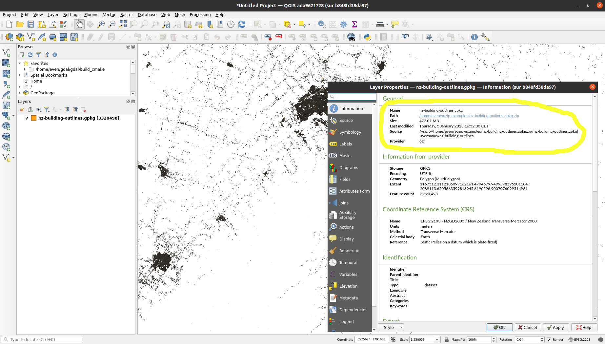

# Announcing SOZip !

January 9th 2023

We are delighted to announce the initial release of the
[specification](../sozip_specification.md) for the SOZip (Seek-Optimized Zip)
profile to the ZIP file format.

## What is SOZip ?

A Seek-Optimized ZIP file (SOZip) is a
[ZIP](https://en.wikipedia.org/wiki/ZIP_(file_format)) file that contains one
or several [Deflate](https://www.ietf.org/rfc/rfc1951.txt)-compressed files
that are organized and annotated such that a SOZip-aware reader can perform
very fast random access (seek) within a compressed file.

SOZip makes it possible to access large compressed files directly from a .zip
file without prior decompression. It is *not* a new file format, but a profile
of the existing ZIP format, done in a fully backward compatible way. ZIP
readers that are non-SOZip aware can read a SOZip-enabled file
normally and ignore the extended features that support efficient seek
capability.

## Use cases

This specification is intended to be general purpose / not domain specific.

SOZip was first developed to serve geospatial use cases, which commonly
have large compressed files inside of ZIP archives. In particular, it makes it
possible for users to read large Geographic Information Systems (GIS) files using the
[Shapefile](https://en.wikipedia.org/wiki/Shapefile),
[GeoPackage](https://www.geopackage.org/) or
[FlatGeobuf](http://flatgeobuf.org/) formats (which have no native provision
for compression) compressed in .zip files without prior decompression.

Efficient random access and selective decompression are a requirement to provide
acceptable performance in many usage scenarios: spatial index filtering, access to a
feature by its identifier, etc.

## Software implementations

-  (C/C++ open source library):
  provides a full featured implementation providing a
  ``sozip`` command line utility to create SOZip-enabled files, append new files
  to them, validate them, reprocess regular ZIP files as SOZip-enabled, etc.
  As well as an updated [/vsizip/](https://gdal.org/user/virtual_file_systems.html#vsizip-zip-archives)
  virtual file system, enabling efficient random reading within a
  SOZip-optimized compressed file.

- [QGIS](https://qgis.org) (Open source Geographic Information System):
  when built against a GDAL version supporting SOZip, QGIS can directly work with
  big GeoPackage, Shapefile or FlatGeobuf SOZip-enabled compressed files, with
  performance close to reading the uncompressed file.

  

- Python [sozipfile](https://github.com/sozip/sozipfile) module: drop-in replacement
  for standard ``zipfile`` module, creating SOZip-enabled files.

See [Annex A: Software implementations](https://github.com/sozip/sozip-spec/blob/master/sozip_specification.md#annex-a-software-implementations)
for more details.

## Examples of SOZip files

Examples of SOZip-enabled files can be found in the
[sozip-examples](https://github.com/sozip/sozip-examples) repository.

## Performance

SOZip is efficient:
- Overhead of using file from a SOZip archive, compared to using it uncompressed,
  is in the order of 10%  for common read operations.
- Generation of a SOZip file can be much faster than regular ZIP generation when
  using multithreading.
- SOZip files are typically only ~ 5% larger than regular ZIPs (dependent on
  content, and chunk size)

Have a look at [benchmarking results](../README.md#benchmarking).

## Other ZIP related specification

This GitHub organization also hosts the
[KeyValuePairs extra-field specification](https://github.com/sozip/keyvaluepairs-spec/blob/master/zip_keyvalue_extra_field_specification.md),
to be able to encode arbitrary key-value pairs of metadata associated with a file
within a ZIP. For example to store the Content-Type of a file.

## How to contribute ?

We welcome contributions to this specification as [issues](https://github.com/sozip/sozip-spec/issues),
[pull requests](https://github.com/sozip/sozip-spec/pulls) or
[discussions](https://github.com/sozip/sozip-spec/discussions).

If you use SOZip or plan to use it for your data delivery, or consider doing a
SOZip implementation, etc., let us know!

## Social media

Find us on  and
[.png)](https://fosstodon.org/@sozip)

## Credits

The SOZip specification and its GDAL implementation have been developed by
[Spatialys](https://spatialys.com), with support from [Safe Software](https://www.safe.com/)
